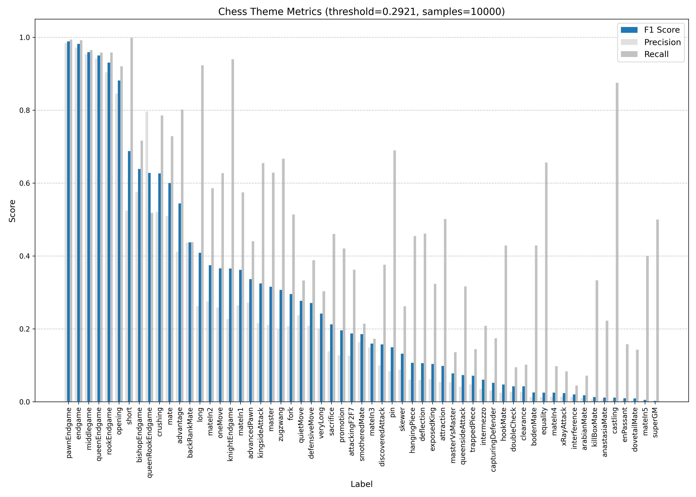
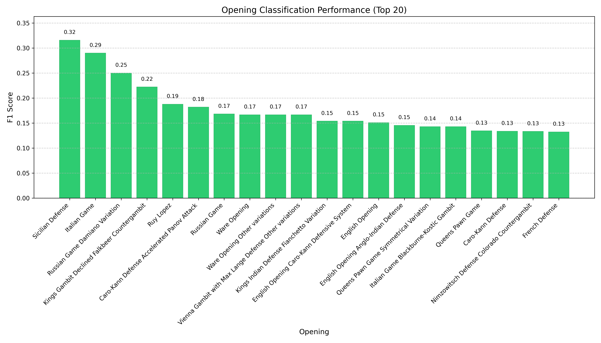
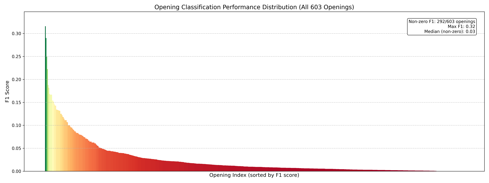
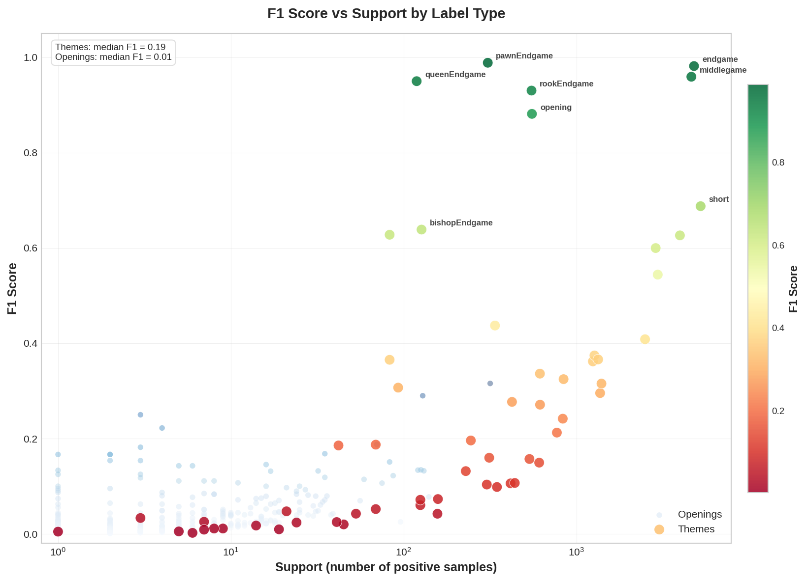
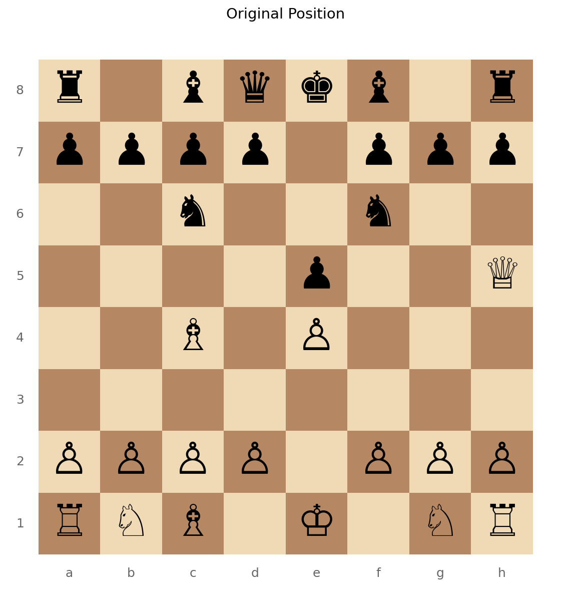
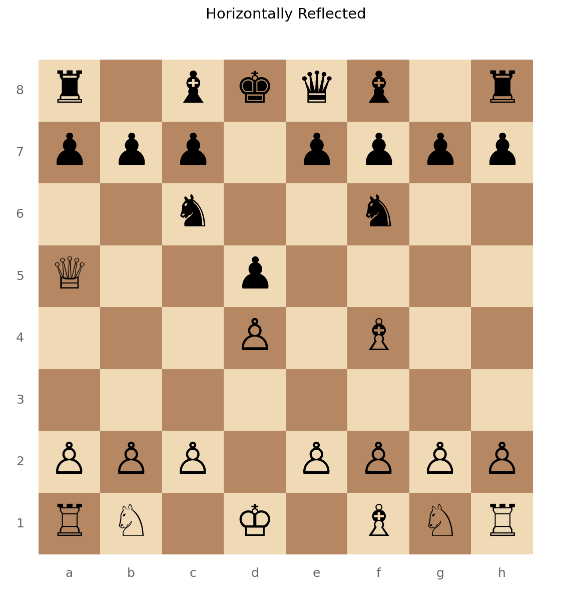
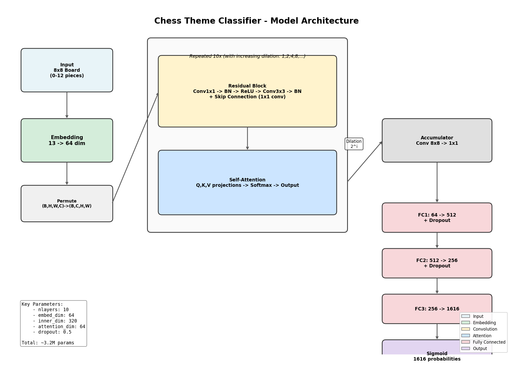

# Chess Theme Classifier


**Multi-label CNN classifier for chess puzzle themes and openings**

1,616 labels | ~5M training samples | Best F1: 0.99

---

## Results

This model classifies chess board positions into themes (tactical patterns, game phases) and openings. Performance varies by category, with game-phase themes achieving near-perfect classification and tactical patterns showing moderate accuracy.

### Theme Classification Performance

| Theme | F1 Score | Support |
|-------|----------|---------|
| pawnEndgame | 0.99 | 307 |
| endgame | 0.98 | 4,795 |
| middlegame | 0.96 | 4,628 |
| queenEndgame | 0.95 | 119 |
| rookEndgame | 0.93 | 550 |
| opening | 0.88 | 553 |
| short | 0.69 | 5,237 |
| bishopEndgame | 0.64 | 127 |
| queenRookEndgame | 0.63 | 83 |
| crushing | 0.63 | 3,974 |
| mate | 0.60 | 2,877 |
| advantage | 0.54 | 2,957 |
| backRankMate | 0.44 | 338 |
| long | 0.41 | 2,497 |
| mateIn2 | 0.37 | 1,272 |

### Opening Classification Performance

| Opening | F1 Score | Support |
|---------|----------|---------|
| Sicilian Defense | 0.32 | 317 |
| Italian Game | 0.29 | 129 |
| Ruy Lopez | 0.19 | 70 |
| Russian Game | 0.17 | 35 |
| English Opening | 0.15 | 83 |
| French Defense | 0.13 | 131 |
| Caro-Kann Defense | 0.13 | 121 |
| Queens Pawn Game | 0.13 | 126 |
| Scandinavian Defense | 0.11 | 75 |
| Kings Indian Defense | 0.08 | 16 |

Opening recognition is more challenging due to the large number of similar variations and the diminishing positional signatures as games progress.

---

## Visualizations

### Theme Performance Chart

The **F1 score** is the harmonic mean of precision and recall, providing a balanced measure of classification performance:

```
F1 = 2 * (Precision * Recall) / (Precision + Recall)
```

Where:
- **Precision** = TP / (TP + FP) - proportion of positive predictions that are correct
- **Recall** = TP / (TP + FN) - proportion of actual positives correctly identified
- **Support** = number of true instances for each label in the test set

This chart shows F1 scores for all 62 chess puzzle themes. Game-phase themes (endgame, middlegame, opening) achieve the highest scores, while tactical patterns like forks and pins show moderate performance.



### Opening Performance Chart

Opening classification is inherently more challenging than theme classification for several reasons:
1. **High cardinality**: 1,554 distinct opening labels vs. 62 themes
2. **Positional similarity**: Many openings share similar early positions
3. **Transpositions**: Different move orders can reach the same position
4. **Signal decay**: Opening signatures weaken as games progress into middlegame



Full distribution of all 1,554 openings (x-axis labels omitted for clarity):



### F1 vs Support Scatter Plot

This scatter plot reveals the relationship between class frequency (support) and model performance (F1 score). Each point represents one of the 1,616 labels.

Key observations:
- **High-support themes** (>1000 samples) cluster at moderate F1 scores (0.4-0.7)
- **Endgame themes** achieve high F1 despite varying support levels
- **Rare openings** (support < 50) typically show F1 near zero
- The model generalizes best to structurally distinct patterns regardless of frequency



### Precision-Recall Curves

Precision-Recall (PR) curves visualize the tradeoff between precision and recall at different classification thresholds. The **Area Under the PR Curve (AUC-PR)** summarizes overall performance.

- **Ideal curve**: Hugs the top-right corner (high precision and recall simultaneously)
- **Random classifier**: Horizontal line at y = (positive samples / total samples)
- **Optimal threshold**: Point on curve maximizing F1 score (marked on each plot)

#### Top 36 Performers (6x6 Matrix)

The highest-performing labels show near-ideal PR curves with AUC-PR > 0.9:


### Data Augmentation Example

Horizontal reflection is used for class-conditional augmentation to address class imbalance in **theme labels only**. Opening labels are not augmented because opening theory is asymmetric (e.g., 1.e4 positions are fundamentally different from 1.d4 positions, and their mirror images do not preserve opening identity).

This augmentation preserves chess semantics for tactical themes (a mirrored fork is still a fork) while effectively doubling samples for underrepresented theme classes.

| Original | Reflected |
|----------|-----------|
|  |  |

---

## Model Architecture

**Type:** CNN with Attention and Residual Blocks



| Parameter | Value |
|-----------|-------|
| Layers | 10 |
| Embedding Dimension | 64 |
| Inner Dim (Residual) | 320 |
| Attention Dimension | 64 |
| Dropout | 50% |
| Input | 8x8 board (13 piece vocabulary) |
| Output | 1,616 labels (sigmoid multi-label) |

### Architecture Details

1. **Input Embedding**: Chess pieces (0-12) are embedded into 64-dimensional vectors
2. **Residual Blocks**: Each block contains:
   - 1x1 convolution for channel projection
   - Batch normalization + ReLU
   - 3x3 dilated convolution (dilation = 2^layer_index)
   - Skip connection via 1x1 convolution
3. **Self-Attention**: After each residual block, a self-attention layer captures long-range piece relationships across the board
4. **Accumulator**: 8x8 convolution reduces spatial dimensions to 1x1
5. **Classification Head**: Three fully-connected layers (64->512->256->1616) with dropout

The exponentially increasing dilation (1, 2, 4, 8, ...) allows the model to capture both local piece interactions and global board patterns.

---

## How It Works

### Data Pipeline

1. **FEN parsing**: Chess positions in FEN notation are converted to 8x8 integer tensors (0-12 piece vocabulary)
2. **Tensor caching**: Preprocessed tensors are cached to disk for fast subsequent access
3. **Class-conditional augmentation**: Underrepresented themes are augmented via horizontal board reflection

### Multi-Label Classification

Each position can have multiple themes (e.g., "mate", "backRankMate", "short") and one opening. The model outputs independent sigmoid probabilities for each of 1,616 labels.

### Class Imbalance Handling

- **Augmentation**: Selective horizontal flipping for rare theme combinations
- **Weighted loss**: Optional per-class loss weighting based on frequency
- **Adaptive thresholding**: Per-class optimal thresholds derived from PR curves

---

## Quick Start

### Installation

```bash
apt update && apt install -y python3-dev python3-pip python3-virtualenv git
git clone git@github.com:jknoll/chess-theme-classifier.git
cd chess-theme-classifier
```

### Create Virtual Environment

```bash
python -m venv .chess-theme-classifier
source .chess-theme-classifier/bin/activate
```

Note: On systems where `python` is not found but `python3` is available, you may need `apt install python3.10-venv`.

### Install Dependencies

```bash
pip install --upgrade pip
pip install -r requirements.txt
```

---

## Dataset

The model is trained on the lichess puzzle database (~5M labeled positions as of 2025-06-24).

### Option 1: Download and Process Raw Dataset

```bash
wget https://database.lichess.org/lichess_db_puzzle.csv.zst
sudo apt install -y zstd
unzstd lichess_db_puzzle.csv.zst
```

To generate the tensor cache from the downloaded CSV:

```bash
python create_full_dataset_cache.py
```

### Option 2: Download Pre-processed Dataset from S3 (Recommended)

The pre-processed dataset includes cached tensors for faster training.

**Set up AWS credentials:**

```bash
# Option A: Environment variables
export AWS_ACCESS_KEY_ID="your_access_key"
export AWS_SECRET_ACCESS_KEY="your_secret_key"

# Option B: AWS CLI
pip install awscli
aws configure

# Option C: Credentials file (~/.aws/credentials)
[default]
aws_access_key_id = your_access_key
aws_secret_access_key = your_secret_key
```

**Download:**

```bash
python download_dataset.py
python download_dataset.py --output-dir custom_directory  # custom location
python download_dataset.py --threads 8 --verify           # parallel + verify
```

---

## Training

### Verify Setup

Test the training loop with a small dataset:

```bash
python train.py --local --test_mode
```

### Distributed Training (Multi-GPU)

```bash
torchrun --nproc_per_node=[NUM_GPUs] train.py
```

### Local Training

```bash
python train.py
python train.py --local       # force local mode
python train.py --distributed # force distributed mode
```

### Training Arguments

| Argument | Description |
|----------|-------------|
| `--test_mode` | Run with smaller dataset for testing |
| `--wandb` | Enable Weights & Biases logging |
| `--project` | W&B project name (default: chess-theme-classifier) |
| `--name` | W&B run name |
| `--checkpoint_steps` | Steps between checkpoints (default: 50000) |

---

## Evaluation

### Recommended: Per-Class Metrics

Generate per-class and global adaptive thresholds:

```bash
python evaluate_model_metrics.py
```

Generate precision-recall curves (run after metrics):

```bash
python evaluate_model_metrics_pr_curves.py
```

### Classification Evaluation

```bash
# Adaptive thresholding (default)
python evaluate_model_classification.py --num_samples=100

# Fixed threshold
python evaluate_model_classification.py --num_samples=100 --threshold=0.3

# Verbose output
python evaluate_model_classification.py --num_samples=50 --verbose

# Minimized output
python evaluate_model_classification.py --num_samples=100 --quiet

# Use cached tensors
python evaluate_model_classification.py --use_cache

# Specific checkpoint
python evaluate_model_classification.py --checkpoint=checkpoints/my_checkpoint.pth
```

### Other Evaluation Scripts

| Script | Purpose |
|--------|---------|
| `evaluate_model_fixed.py` | Maps between training/test indices, supports adaptive thresholding |
| `evaluate_model_simple.py` | Focused on key chess themes |
| `evaluate_model_cache.py` | Uses cached tensors directly |

See [docs/model_evaluation.md](docs/model_evaluation.md) for detailed documentation.

---

## Class Imbalance Handling

### Class-Conditional Augmentation

The augmented dataset uses the `_conditional` suffix:

```
lichess_db_puzzle_test.csv.tensors.pt_conditional
```

Generate augmentation for a dataset:

```bash
python -c "from dataset import ChessPuzzleDataset; ChessPuzzleDataset('lichess_db_puzzle_test.csv', class_conditional_augmentation=True)"
```

### Training with Weighted Loss

```bash
python train_locally_single_gpu.py --test_mode --weighted_loss
```

Note: Combining class-balanced dataset with weighted loss can cause unstable training (Jaccard similarity oscillations).

### View Co-occurrence Matrices

```bash
python -c 'import json; import pprint; with open("lichess_db_puzzle_test.csv.cooccurrence.json", "r") as f: pprint.pprint(json.load(f))'
```

---

## Metrics Explanation

### Micro Averaging

- Aggregates all TP, FP, FN across classes before calculating
- Gives equal weight to each sample-class pair
- Favors performance on common themes

### Macro Averaging

- Calculates metrics per class, then averages
- Each theme contributes equally regardless of frequency
- Use when rare theme performance matters

### Weighted Averaging

- Weighted average of per-class metrics by frequency
- Balanced view reflecting dataset distribution

---

## Testing

### Unit Tests

```bash
python -m pytest tests/
```

Tests run automatically on push/PR via GitHub Actions (see `.github/workflows/test.yml`).

See [tests/README.md](tests/README.md) for details.

---

## Project Structure

```
chess-theme-classifier/
|-- train.py                    # Main training script
|-- model.py                    # CNN architecture
|-- dataset.py                  # Data loading and caching
|-- model_config.yaml           # Model hyperparameters
|-- requirements.txt            # Dependencies
|-- evaluate_model_*.py         # Evaluation scripts
|-- create_full_dataset_cache.py
|-- download_dataset.py
|
|-- analysis/
|   |-- f1/                     # F1 charts and per-class thresholds
|   |-- pr-curves/              # Precision-recall curves
|   |-- scatter/                # F1 vs support plots
|
|-- checkpoints_pretrained/     # Pre-trained model checkpoints
|-- processed_lichess_puzzle_files/  # Cached tensors and datasets
|-- docs/                       # Additional documentation
|-- tests/                      # Unit tests
```

---

## Documentation

- [Model Evaluation Guide](docs/model_evaluation.md)
- [Adaptive Thresholding](docs/adaptive_thresholding.md)
- [Per-Class Adaptive Thresholding](docs/per-class-adaptive-thresholding.md)
- [Precision-Recall Curves](docs/precision-recall-curves.md)
- [Class Imbalance Work](docs/class_imbalance_work_breakdown.md)
- [Dataset Download from S3](docs/dataset-download-from-s3.md)
- [Checkpoint Management](docs/loading_and_saving_local_vs_cluster_checkpoints.md)

---

## Notes

### train.py vs train-isc.py

`train.py` supports both local and cluster training. The `train-isc.py` script is deprecated.

### Tensor Cache

The dataset class generates a `.tensors.pt` cache file on first access. Cache validation checks CSV modification time to ensure consistency. Typical speedup is 2-3x for dataset access.
